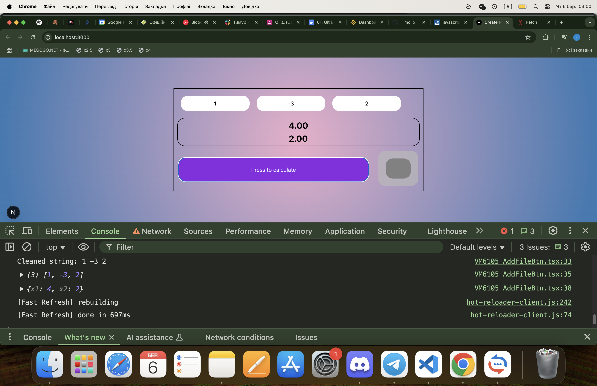

This is a [Next.js](https://nextjs.org) project bootstrapped with [`create-next-app`](https://nextjs.org/docs/app/api-reference/cli/create-next-app).

# 📐 Square Equation Calculator

  
_(Replace `path/to/image.png` with your actual image path)_

## 📖 About

This project is a **Square Equation Calculator** that finds the roots of a quadratic equation of the form:

\[
ax^2 + bx + c = 0
\]

It accepts coefficients `a`, `b`, and `c` from a file and computes the roots using the quadratic formula.

---

## 🚀 Features

✅ Supports reading coefficients from a file  
✅ Implements the quadratic formula  
✅ Displays real and complex roots  
✅ Simple and user-friendly interface

---

## 🛠 Installation

**Clone the repository**

```sh
git clone https://github.com/yourusername/sqr_calculator.git
cd sqr_calculator
```

## Getting Started

First, run the development server:

```bash
npm run dev
# or
yarn dev
# or
pnpm dev
# or
bun dev
```

Open [http://localhost:3000](http://localhost:3000) with your browser to see the result.

You can start editing the page by modifying `app/page.tsx`. The page auto-updates as you edit the file.

This project uses [`next/font`](https://nextjs.org/docs/app/building-your-application/optimizing/fonts) to automatically optimize and load [Geist](https://vercel.com/font), a new font family for Vercel.

## Learn More

To learn more about Next.js, take a look at the following resources:

- [Next.js Documentation](https://nextjs.org/docs) - learn about Next.js features and API.
- [Learn Next.js](https://nextjs.org/learn) - an interactive Next.js tutorial.

You can check out [the Next.js GitHub repository](https://github.com/vercel/next.js) - your feedback and contributions are welcome!

## Deploy on Vercel

The easiest way to deploy your Next.js app is to use the [Vercel Platform](https://vercel.com/new?utm_medium=default-template&filter=next.js&utm_source=create-next-app&utm_campaign=create-next-app-readme) from the creators of Next.js.

Check out our [Next.js deployment documentation](https://nextjs.org/docs/app/building-your-application/deploying) for more details.

## Example of program working





